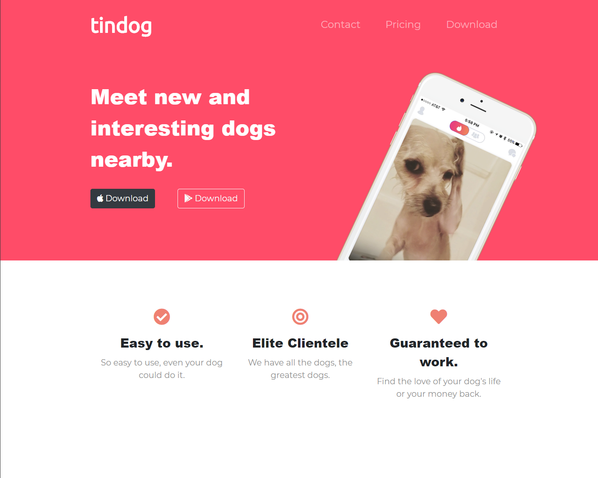
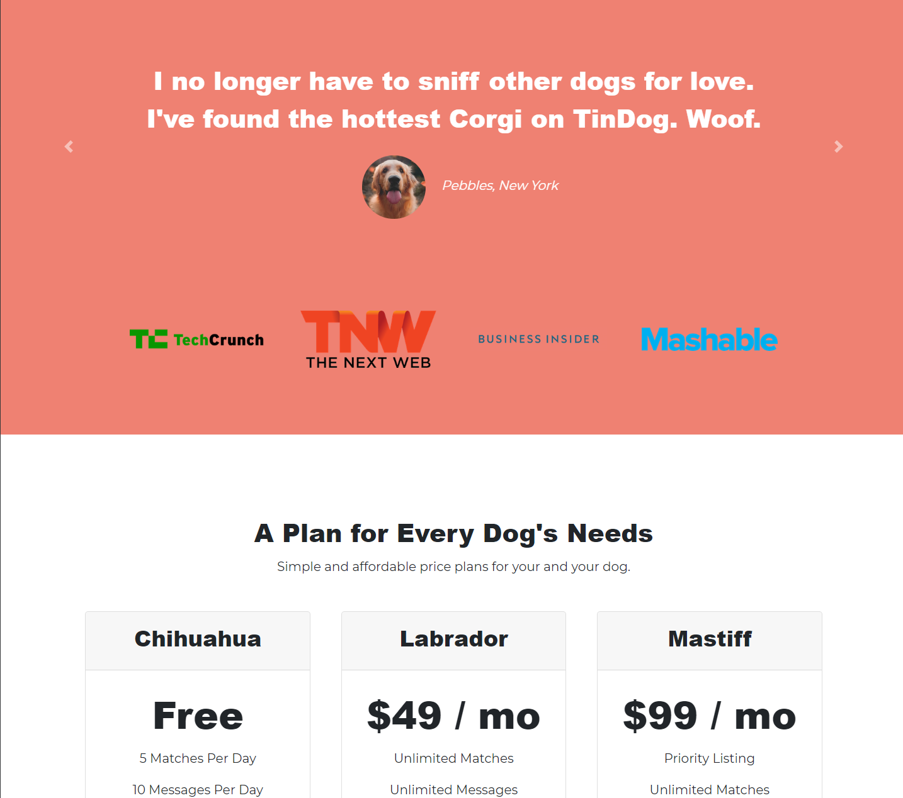
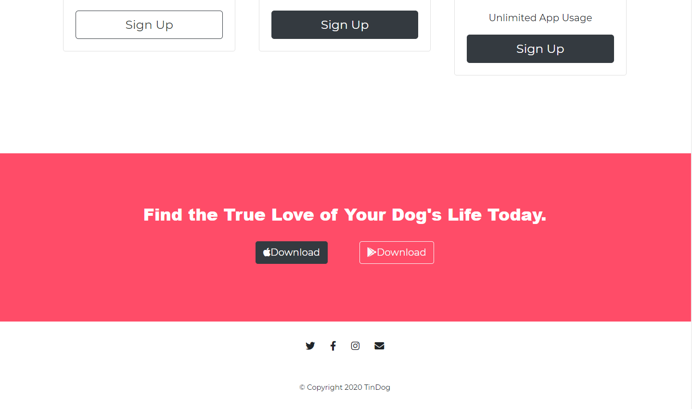

# Tindog

> Bootstrap Challenge #1
___

### Table of Contents

- [Description](#description)
- [Usage](#usage)
- [Credits](#credits)
___

## Description
This project introduced us to using the Bootstrap framework to speed up the process of building a responsive website. The concept of this website is an app called Tindog. We made use of <a href="https://fontawesome.com/"/>FontAwesome</a> to generate icons that are displayed in the button. We also learned about CSS positioning. Color pallets and we dived deeper into our understanding of Bootstrap as a framework. We also made use of <a href="https://developer.mozilla.org/en-US/docs/Web/CSS/Media_Queries/Using_media_queries"/>CSS media queries</a> to make our website resposive to the browser size. We then practiced a software development principle called <a href="https://en.wikipedia.org/wiki/Don%27t_repeat_yourself"/>D.R.Y</a> or Do Not Repeat Yourself. We refactored our code using that principle and it minimized the amount of code used in our CSS.

#### Technologies Used:
- HTML
- CSS
- Javascript
- <a href="https://fontawesome.com/"/>FontAwesome</a>
- <a href="https://getbootstrap.com/">Bootstrap 4.5</a>
- <a href="https://fonts.google.com/">Google Fonts</a>
- <a href="https://atom.io/">Atom</a>
___

## Usage
This project has no usage other than to present future employers of my progress as a Fullstack Web Developer.
___

## Credits
- Dr. Angela Yu
- Udemy
